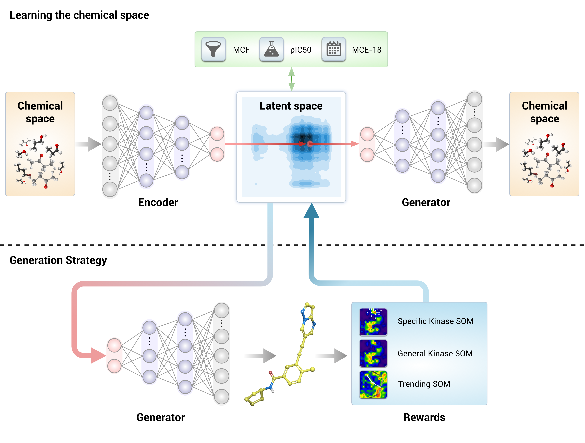

# Pro Generative Tensorial Reinforcement Learning (proGENTRL) 

This is a [Pytorch Lightning](https://github.com/PyTorchLightning/pytorch-lightning) implementation of [GENTRL](https://github.com/insilicomedicine/gentrl). Recently Pytorch Lightning has gained much popularity due to its lightweight framework and flexibility with handling multiple devices from a single GPU to a HPC cluster. So in order to maximize the efficiency of using GENTRL on multi-GPU environment I have implemented this pytorch lightning code.

## What is GENTRL?
The GENTRL model is a variational autoencoder with a rich prior distribution of the latent space. We used tensor decompositions to encode the relations between molecular structures and their properties and to learn on data with missing values. We train the model in two steps. First, we learn a mapping of a chemical space on the latent manifold by maximizing the evidence lower bound. We then freeze all the parameters except for the learnable prior and explore the chemical space to find molecules with a high reward.



# Installation

## Step 1 :
Make a new conda environment and install RDKit.
```
conda create -c rdkit -n my-rdkit-env rdkit
```
Then activate this new environment.
```
conda activate my-rdkit-env
```
*Note :*  Make sure that the python3 version is 3.5 or higher and pip3 is installed

## Step 2 :
Inside this environment install proGENTRL.
```
cd <Path_to_proGENTRL_folder>
python3 setup.py install
```

## Step 3 : (Optional)
Making a new **Kernel** for jupyter notebook is recommended. For making a new kernel please follow these steps.
```
python3 -m pip install ipykernel
python3 -m ipykernel install --user --name rdkit_kernel
```
Now when you open jupyter notebook. Go to **Change Kernel** > **rdkit_kernel**

With these the installation is over and now we are ready to run the `Example.ipynb` notebook provided in the Repo.

##`Example.ipynb`
This notebook is a good starting point to look at how proGENTRL works. It incorporates all the steps from *VAE Training* to *Reinforcement Learning* and finally *Sampling* or generation of new molecules in the form of SMILES strings.

The basic flow of the model is:
VAE Train &#8594; Reinforcement Learning &#8594; Sampling

Below we show examples of generated molecules (more samples [here](https://github.com/Bibyutatsu/GENTRL/blob/master/images/Sampling_big.png)). You can find more explanations in my originarlly forked Repo of GENTRL please visit [here](https://github.com/Bibyutatsu/GENTRL)


Supporting Information for the paper _"[Deep learning enables rapid identification of potent DDR1 kinase inhibitors](https://www.nature.com/articles/s41587-019-0224-x)"_.
Original [Repo](https://github.com/insilicomedicine/gentrl)